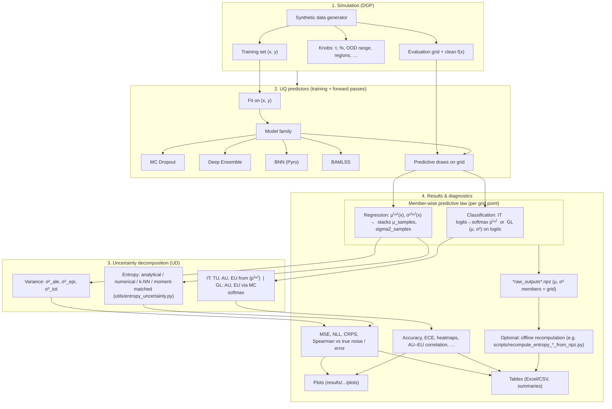
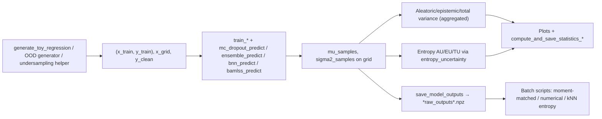
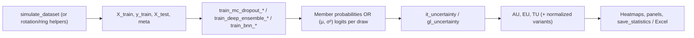
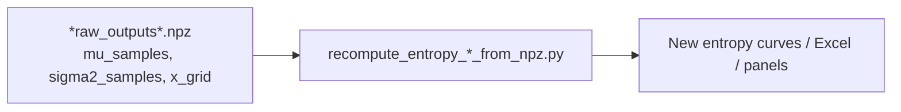

# Experiment pipeline: simulation → UQ models → decomposition → results

This document sketches the **end-to-end flow** implemented in the repository: synthetic data, training **uncertainty-quantifying (UQ)** predictors, **post-hoc decomposition** of total uncertainty into aleatoric vs epistemic components (“uncertainty disentanglement”, UD), and exported artifacts.

**Suggested format:** Markdown + **Mermaid** diagrams (render in GitHub/GitLab, VS Code “Markdown Preview”, Cursor, etc.). For a static PDF/slide, export the Mermaid blocks using [mermaid.live](https://mermaid.live) or a Pandoc/`mmdc` toolchain.

---

## High-level flow

---

## Regression (toy 1D): typical `utils/*_experiments.py` path

---

## Classification (2D blobs, etc.): `utils/classification_experiments.py`

---

## What lives where (quick map)

| Stage | Main locations |
|-------|----------------|
| Regression DGP | `utils/ood_experiments.py`, `sample_size_experiments.py`, `noise_level_experiments.py`, `undersampling_experiments.py`, `ovb_experiments.py`; notebooks under `Experiments/` |
| Classification DGP | `utils/classification_data.py`, `utils/classification_experiments.py` |
| Neural / BAMLSS training | `Models/`, `utils/classification_models.py` |
| Variance decomposition | Aggregates of `σ²` and `Var(μ)` over members (same experiment files) |
| Entropy (regression) | `utils/entropy_uncertainty.py`; batch recomputation under `scripts/recompute_entropy_*.py` |
| IT/GL decomposition (clf.) | `utils/classification_experiments.py` (`it_uncertainty`, `gl_uncertainty`) |
| Persistence | `utils/results_save.py` (`save_model_outputs`, `save_statistics`, …) |
| Default results tree | `results/<experiment>/plots`, `results/.../statistics`, `results/.../outputs` |

---

## Optional offline loop (entropy recomputation)

OOD masks for batch tools are rebuilt from `x_grid` plus configured OOD intervals (see `utils/knn_entropy_regression.py`, `DEFAULT_OOD_RANGES`), not re-read from the `.npz` as a separate metadata field.

---

## Rendering tips

- **VS Code / Cursor:** open this file → Markdown preview.
- **GitHub:** commit and view the file; Mermaid renders automatically.
- **LaTeX thesis:** paste a PNG exported from mermaid.live, or use `\usepackage{mermaid}`-compatible packages if your template supports it.

If you want a single **PDF one-pager**, the first diagram is usually enough; keep the regression/classification subgraphs as appendices.
